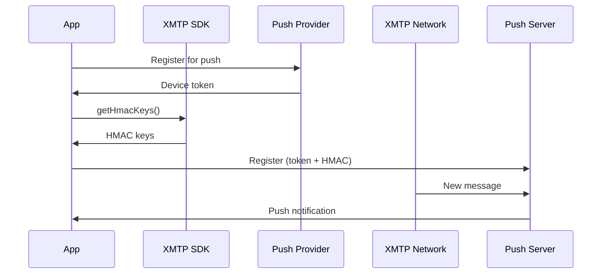

## Overview

XMTP supports push notifications to alert users of new messages even when your app is not in the foreground. The SDK provides HMAC-based authentication for secure push notification registration.

## Push Notification Flow



## Prerequisites

### 1. Enable Push Notifications in Xcode

1. Open your project in Xcode
2. Select your target → Signing & Capabilities
3. Click + Capability
4. Add "Push Notifications"

### 2. APNs Certificate

Create and configure an APNs certificate in Apple Developer Portal:

1. Go to Certificates, Identifiers & Profiles
2. Create a new certificate
3. Choose Apple Push Notification service SSL
4. Upload to your push notification service

## Implementation

### Step 1: Request Push Permission

```swift
import UserNotifications

class PushNotificationManager {
  static func requestPermission() async throws {
    let center = UNUserNotificationCenter.current()
    
    let granted = try await center.requestAuthorization(
      options: [.alert, .badge, .sound]
    )
    
    guard granted else {
      throw PushError.permissionDenied
    }
    
    await MainActor.run {
      UIApplication.shared.registerForRemoteNotifications()
    }
  }
}
```

### Step 2: Get Device Token

```swift
import UIKit

class AppDelegate: UIResponder, UIApplicationDelegate {
  func application(
    _ application: UIApplication,
    didRegisterForRemoteNotificationsWithDeviceToken deviceToken: Data
  ) {
    let tokenString = deviceToken.map { String(format: "%02x", $0) }.joined()
    print("Device token: \(tokenString)")
    
    // Store token for later use
    UserDefaults.standard.set(tokenString, forKey: "apns_device_token")
  }
  
  func application(
    _ application: UIApplication,
    didFailToRegisterForRemoteNotificationsWithError error: Error
  ) {
    print("Failed to register: \(error)")
  }
}
```

### Step 3: Get HMAC Keys from XMTP

XMTP provides HMAC keys for secure push registration:

```swift
import XMTPiOS

func registerForXMTPPush(client: Client) async throws {
  // Get HMAC keys for push authentication
  let hmacKeys = try await client.conversations.getHmacKeys()
  
  // Get device token
  guard let deviceToken = UserDefaults.standard.string(forKey: "apns_device_token") else {
    throw PushError.noDeviceToken
  }
  
  // Register with your push server
  try await registerWithPushServer(
    deviceToken: deviceToken,
    hmacKeys: hmacKeys
  )
}
```

### Step 4: Register with Push Server

Send the device token and HMAC keys to your push notification server:

```swift
func registerWithPushServer(
  deviceToken: String,
  hmacKeys: HmacKeys
) async throws {
  let url = URL(string: "https://your-push-server.com/register")!
  
  var request = URLRequest(url: url)
  request.httpMethod = "POST"
  request.setValue("application/json", forHTTPHeaderField: "Content-Type")
  
  let payload = [
    "device_token": deviceToken,
    "hmac_keys": [
      "thirtyDayPeriodsSinceEpoch": hmacKeys.thirtyDayPeriodsSinceEpoch,
      "values": hmacKeys.values
    ]
  ] as [String: Any]
  
  request.httpBody = try JSONSerialization.data(withJSONObject: payload)
  
  let (_, response) = try await URLSession.shared.data(for: request)
  
  guard let httpResponse = response as? HTTPURLResponse,
        httpResponse.statusCode == 200 else {
    throw PushError.registrationFailed
  }
}
```

## Push Topics

Each conversation has push topics for targeted notifications:

```swift
// Get all push topics for all conversations
let allTopics = try await client.conversations.allPushTopics()

// Get push topics for a specific group
let groupTopics = try await group.getPushTopics()

// Get HMAC keys for specific topics
let hmacKeys = try await group.getHmacKeys()
```

## Handle Duplicate DMs

For direct messages, handle potential duplicates:

```swift
func getDMPushTopics(dm: Dm) async throws -> [String] {
  // DMs may have duplicate topics
  let topics = try await dm.getPushTopics()
  return Array(Set(topics))  // Remove duplicates
}
```

## Receiving Notifications

### Handle Notification Tap

```swift
extension AppDelegate: UNUserNotificationCenterDelegate {
  func userNotificationCenter(
    _ center: UNUserNotificationCenter,
    didReceive response: UNNotificationResponse,
    withCompletionHandler completionHandler: @escaping () -> Void
  ) {
    let userInfo = response.notification.request.content.userInfo
    
    // Extract conversation ID from notification
    if let conversationId = userInfo["conversation_id"] as? String {
      // Navigate to conversation
      NotificationCenter.default.post(
        name: .openConversation,
        object: nil,
        userInfo: ["id": conversationId]
      )
    }
    
    completionHandler()
  }
  
  func userNotificationCenter(
    _ center: UNUserNotificationCenter,
    willPresent notification: UNNotification,
    withCompletionHandler completionHandler: @escaping (UNNotificationPresentationOptions) -> Void
  ) {
    // Show notification even when app is in foreground
    completionHandler([.banner, .sound, .badge])
  }
}
```

## Server-Side Implementation

Your push server needs to:

1. **Store registrations**: Save device tokens and HMAC keys
2. **Verify HMAC**: Validate messages using HMAC keys
3. **Send notifications**: Use APNs to deliver push notifications

### Example Server Logic (Pseudocode)

```typescript
// On receiving a message from XMTP network
async function handleIncomingMessage(message) {
  // Get subscribers for this topic
  const subscribers = await db.getSubscribersForTopic(message.topic)
  
  for (const subscriber of subscribers) {
    // Verify HMAC
    const isValid = verifyHMAC(
      message,
      subscriber.hmacKeys
    )
    
    if (isValid) {
      // Send push notification
      await sendAPNs(subscriber.deviceToken, {
        title: "New Message",
        body: "You have a new XMTP message",
        conversationId: message.conversationId
      })
    }
  }
}
```

## HMAC Verification

The HMAC keys authenticate that messages are genuine:

```swift
// HMAC keys are time-based (30-day periods)
struct HmacKeys {
  let thirtyDayPeriodsSinceEpoch: Int
  let values: [Data]
}

// Server verifies messages using these keys
// Implementation depends on your server infrastructure
```

## Best Practices

<AccordionGroup>
  <Accordion title="Refresh HMAC Keys Regularly">
    - HMAC keys are time-based (30-day periods)
    - Fetch new keys when they expire
    - Update your push server with new keys
    - Keep old keys temporarily for overlap
  </Accordion>

  <Accordion title="Handle Permission Changes">
    - Check permission status on app launch
    - Re-request if denied previously
    - Unregister if user revokes permission
    - Provide in-app explanation for permission
  </Accordion>

  <Accordion title="Optimize Notification Content">
    - Include conversation ID in payload
    - Add sender info if available
    - Consider message preview (if not sensitive)
    - Support notification categories and actions
  </Accordion>

  <Accordion title="Test Thoroughly">
    - Test with production APNs certificate
    - Test background, foreground, and terminated states
    - Test notification tap handling
    - Verify HMAC verification on server
  </Accordion>

  <Accordion title="Handle Errors Gracefully">
    - Log registration failures
    - Retry on transient errors
    - Fall back to in-app polling if push fails
    - Notify users of permission issues
  </Accordion>
</AccordionGroup>

## Complete Example

```swift
import UIKit
import UserNotifications
import XMTPiOS

class PushManager {
  static let shared = PushManager()
  
  func setup() async throws {
    // Request permission
    try await requestPermission()
    
    // Register for remote notifications
    await MainActor.run {
      UIApplication.shared.registerForRemoteNotifications()
    }
  }
  
  func registerXMTPPush(client: Client) async throws {
    // Get device token
    guard let deviceToken = getStoredDeviceToken() else {
      throw PushError.noDeviceToken
    }
    
    // Get HMAC keys
    let hmacKeys = try await client.conversations.getHmacKeys()
    
    // Get all push topics
    let topics = try await client.conversations.allPushTopics()
    
    // Register with server
    try await registerWithServer(
      deviceToken: deviceToken,
      hmacKeys: hmacKeys,
      topics: topics
    )
  }
  
  func unregisterXMTPPush() async throws {
    guard let deviceToken = getStoredDeviceToken() else { return }
    try await unregisterFromServer(deviceToken: deviceToken)
  }
  
  private func requestPermission() async throws {
    let center = UNUserNotificationCenter.current()
    let granted = try await center.requestAuthorization(
      options: [.alert, .badge, .sound]
    )
    guard granted else {
      throw PushError.permissionDenied
    }
  }
  
  private func getStoredDeviceToken() -> String? {
    UserDefaults.standard.string(forKey: "apns_device_token")
  }
  
  private func registerWithServer(
    deviceToken: String,
    hmacKeys: HmacKeys,
    topics: [String]
  ) async throws {
    // Implementation depends on your push server
  }
  
  private func unregisterFromServer(deviceToken: String) async throws {
    // Implementation depends on your push server
  }
}

enum PushError: Error {
  case permissionDenied
  case noDeviceToken
  case registrationFailed
}
```

## Debugging

### Check Push Registration

```swift
let center = UNUserNotificationCenter.current()
let settings = await center.notificationSettings()

switch settings.authorizationStatus {
case .authorized:
  print("Push notifications enabled")
case .denied:
  print("User denied push notifications")
case .notDetermined:
  print("Permission not requested")
default:
  break
}
```

### Test Push Notifications

Use command line to test APNs:

```bash
# Requires APNs authentication key or certificate
curl -v \
  --header "apns-topic: com.yourapp.bundle" \
  --header "apns-push-type: alert" \
  --cert YourCertificate.pem \
  --data '{"aps":{"alert":"Test"}}' \
  https://api.push.apple.com/3/device/YOUR_DEVICE_TOKEN
```

## Next Steps

<CardGroup cols={2}>
  <Card title="Conversations API" icon="messages" href="/api/conversations">
    Learn about push topics and HMAC keys
  </Card>
  <Card title="Group API" icon="users" href="/api/group">
    Group-specific push methods
  </Card>
  <Card title="Receiving Messages" icon="inbox" href="/guides/receiving-messages">
    Handle incoming messages
  </Card>
  <Card title="Client Options" icon="gear" href="/api/client-options">
    Configure client for push
  </Card>
</CardGroup>

## Related

- [Apple Push Notification Service](https://developer.apple.com/documentation/usernotifications) - Official APNs documentation
- [UserNotifications Framework](https://developer.apple.com/documentation/usernotifications) - iOS notification framework
