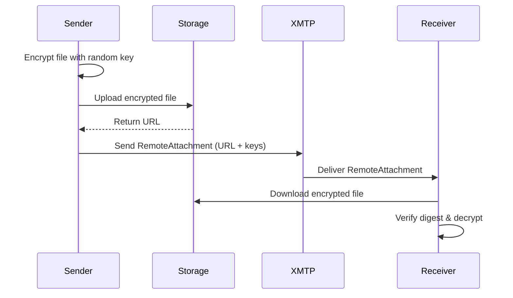

## Overview

The `RemoteAttachmentCodec` enables sending large file attachments by uploading them to external storage and sending only an encrypted reference. The file is encrypted client-side before upload, ensuring end-to-end security.

<Info>
This is the recommended approach for files larger than 1 MB. For smaller files, you can use [AttachmentCodec](/api/codecs/attachment).
</Info>

## Content Type ID

```swift
ContentTypeRemoteAttachment = ContentTypeID(
    authorityID: "xmtp.org",
    typeID: "remoteStaticAttachment",
    versionMajor: 1,
    versionMinor: 0
)
```

## How It Works

1. **Encrypt**: Content is encrypted with AES-256-GCM using a random secret key
2. **Upload**: Encrypted payload is uploaded to your storage provider (HTTPS required)
3. **Send**: Message contains URL, encryption keys, and content digest
4. **Receive**: Recipient downloads, verifies digest, and decrypts with provided keys



## Structure

### RemoteAttachment

```swift
public struct RemoteAttachment {
    public var url: String
    public var contentDigest: String
    public var secret: Data
    public var salt: Data
    public var nonce: Data
    public var scheme: Scheme
    
    // Optional metadata
    public var contentLength: Int?
    public var filename: String?
    
    public enum Scheme: String {
        case https
    }
}
```

#### Properties

<ParamField path="url" type="String" required>
  HTTPS URL where the encrypted file is stored
</ParamField>

<ParamField path="contentDigest" type="String" required>
  SHA-256 hash of the encrypted payload for integrity verification
</ParamField>

<ParamField path="secret" type="Data" required>
  32-byte encryption key used to decrypt the file
</ParamField>

<ParamField path="salt" type="Data" required>
  Salt used in HKDF key derivation
</ParamField>

<ParamField path="nonce" type="Data" required>
  Nonce used in AES-256-GCM encryption
</ParamField>

<ParamField path="scheme" type="Scheme" required>
  URL scheme (must be HTTPS)
</ParamField>

<ParamField path="contentLength" type="Int?">
  Size of the encrypted file in bytes
</ParamField>

<ParamField path="filename" type="String?">
  Original filename for display purposes
</ParamField>

### EncryptedEncodedContent

```swift
public struct EncryptedEncodedContent {
    public var secret: Data
    public var digest: String
    public var salt: Data
    public var nonce: Data
    public var payload: Data
    public var filename: String?
}
```

## Usage

### Registering the Codec

```swift
import XMTPiOS

Client.register(codec: RemoteAttachmentCodec())
Client.register(codec: AttachmentCodec()) // Often used together
```

### Sending Remote Attachments

```swift
// Step 1: Encrypt the file
let fileData = try Data(contentsOf: fileURL)
let attachment = Attachment(
    filename: "document.pdf",
    mimeType: "application/pdf",
    data: fileData
)

let encrypted = try RemoteAttachment.encodeEncrypted(
    content: attachment,
    codec: AttachmentCodec()
)

// Step 2: Upload encrypted payload to your storage
let uploadURL = try await uploadToStorage(encrypted.payload)

// Step 3: Create remote attachment reference
var remoteAttachment = try RemoteAttachment(
    url: uploadURL.absoluteString,
    encryptedEncodedContent: encrypted
)
remoteAttachment.filename = "document.pdf"
remoteAttachment.contentLength = encrypted.payload.count

// Step 4: Send the reference
try await conversation.send(
    content: remoteAttachment,
    options: .init(contentType: ContentTypeRemoteAttachment)
)
```

### Receiving Remote Attachments

```swift
let messages = try await conversation.messages()

for message in messages {
    if message.contentTypeId == ContentTypeRemoteAttachment.id {
        let remoteAttachment: RemoteAttachment = try message.content()
        
        print("Filename: \(remoteAttachment.filename ?? "unknown")")
        print("Size: \(remoteAttachment.contentLength ?? 0) bytes")
        
        // Download and decrypt
        let encodedContent = try await remoteAttachment.content()
        let attachment: Attachment = try encodedContent.decoded()
        
        // Save to file
        let saveURL = FileManager.default.temporaryDirectory
            .appendingPathComponent(attachment.filename)
        try attachment.data.write(to: saveURL)
    }
}
```

## Encryption API

### Encrypting Content

```swift
// Encrypt any content type
let encrypted = try RemoteAttachment.encodeEncrypted(
    content: myContent,
    codec: MyCodec()
)

// Encrypt raw bytes
let encrypted = try RemoteAttachment.encodeEncryptedBytes(
    encodedContent: rawData,
    filename: "file.bin"
)
```

### Decrypting Content

```swift
let decrypted = try RemoteAttachment.decryptEncoded(
    encrypted: encryptedContent
)
```

### Fetching Remote Content

```swift
// Automatically downloads, verifies digest, and decrypts
let encodedContent = try await remoteAttachment.content()
let attachment: Attachment = try encodedContent.decoded()
```

## Implementation Details

### Encoding

```swift
public func encode(content: RemoteAttachment) throws -> EncodedContent {
    var encodedContent = EncodedContent()
    encodedContent.type = ContentTypeRemoteAttachment
    encodedContent.content = Data(content.url.utf8)
    encodedContent.parameters = [
        "contentDigest": content.contentDigest,
        "secret": content.secret.toHex,
        "salt": content.salt.toHex,
        "nonce": content.nonce.toHex,
        "scheme": "https",
        "contentLength": String(content.contentLength ?? -1),
        "filename": content.filename ?? "",
    ]
    return encodedContent
}
```

### Decoding

```swift
public func decode(content: EncodedContent) throws -> RemoteAttachment {
    guard let url = String(data: content.content, encoding: .utf8) else {
        throw RemoteAttachmentError.invalidURL
    }
    
    guard let contentDigest = content.parameters["contentDigest"] else {
        throw RemoteAttachmentError.invalidDigest("missing contentDigest parameter")
    }
    
    let secret = try getHexParameter("secret", from: content.parameters)
    let salt = try getHexParameter("salt", from: content.parameters)
    let nonce = try getHexParameter("nonce", from: content.parameters)
    
    var attachment = try RemoteAttachment(
        url: url,
        contentDigest: contentDigest,
        secret: secret,
        salt: salt,
        nonce: nonce,
        scheme: .https
    )
    
    if let contentLength = content.parameters["contentLength"] {
        attachment.contentLength = Int(contentLength)
    }
    
    if let filename = content.parameters["filename"] {
        attachment.filename = filename
    }
    
    return attachment
}
```

### Fallback

```swift
public func fallback(content: RemoteAttachment) throws -> String? {
    "Can't display \"\(String(describing: content.filename))\". This app doesn't support attachments."
}
```

## Error Handling

```swift
public enum RemoteAttachmentError: Error {
    case invalidURL
    case v1NotSupported
    case invalidParameters(String)
    case invalidDigest(String)
    case invalidScheme(String)
    case payloadNotFound
}
```

### Example

```swift
do {
    let remoteAttachment: RemoteAttachment = try message.content()
    let content = try await remoteAttachment.content()
} catch RemoteAttachmentError.invalidURL {
    print("Invalid attachment URL")
} catch RemoteAttachmentError.invalidDigest(let message) {
    print("Digest verification failed: \(message)")
} catch RemoteAttachmentError.invalidScheme(let message) {
    print("Invalid URL scheme: \(message)")
} catch RemoteAttachmentError.payloadNotFound {
    print("File not found at URL")
} catch {
    print("Error: \(error)")
}
```

## Security Considerations

<Warning>
**HTTPS Required**: Only HTTPS URLs are allowed. HTTP URLs will throw `RemoteAttachmentError.invalidScheme`.
</Warning>

<Info>
**Digest Verification**: The content digest is automatically verified during decryption. If the downloaded file doesn't match the digest, `RemoteAttachmentError.invalidDigest` is thrown.
</Info>

<Tip>
**End-to-End Encryption**: Files are encrypted client-side before upload. Your storage provider cannot read the file contents.
</Tip>

## Storage Provider Integration

You need to implement file upload to your chosen storage provider:

```swift
func uploadToStorage(_ data: Data) async throws -> URL {
    // Example: AWS S3, Cloudflare R2, etc.
    let uploadURL = URL(string: "https://your-storage.com/upload")!
    
    var request = URLRequest(url: uploadURL)
    request.httpMethod = "POST"
    request.httpBody = data
    
    let (data, response) = try await URLSession.shared.data(for: request)
    
    // Parse response to get file URL
    let fileURL = // ... parse from response
    return fileURL
}
```

## Complete Example

```swift
import XMTPiOS

class RemoteAttachmentExample {
    func sendLargeFile() async throws {
        // Register codecs
        Client.register(codec: RemoteAttachmentCodec())
        Client.register(codec: AttachmentCodec())
        
        // Load file
        let fileURL = Bundle.main.url(forResource: "video", withExtension: "mp4")!
        let fileData = try Data(contentsOf: fileURL)
        
        // Create attachment
        let attachment = Attachment(
            filename: "video.mp4",
            mimeType: "video/mp4",
            data: fileData
        )
        
        // Encrypt
        let encrypted = try RemoteAttachment.encodeEncrypted(
            content: attachment,
            codec: AttachmentCodec()
        )
        
        // Upload to storage
        let uploadedURL = try await uploadToS3(encrypted.payload)
        
        // Create remote attachment
        var remoteAttachment = try RemoteAttachment(
            url: uploadedURL.absoluteString,
            encryptedEncodedContent: encrypted
        )
        remoteAttachment.filename = "video.mp4"
        remoteAttachment.contentLength = encrypted.payload.count
        
        // Send
        let conversation = try await client.conversations
            .newConversation(with: recipientAddress)
        try await conversation.send(
            content: remoteAttachment,
            options: .init(contentType: ContentTypeRemoteAttachment)
        )
    }
    
    func receiveLargeFile(message: DecodedMessage) async throws {
        let remoteAttachment: RemoteAttachment = try message.content()
        
        // Download and decrypt
        let encodedContent = try await remoteAttachment.content()
        let attachment: Attachment = try encodedContent.decoded()
        
        // Save to file
        let documentsURL = FileManager.default.urls(
            for: .documentDirectory,
            in: .userDomainMask
        )[0]
        let fileURL = documentsURL.appendingPathComponent(attachment.filename)
        try attachment.data.write(to: fileURL)
        
        print("Saved to: \(fileURL.path)")
    }
}
```

## Related

- [AttachmentCodec](/api/codecs/attachment) - For inline attachments
- [ContentCodec Protocol](/api/content-codec) - Base protocol for all codecs
- [Encryption](/advanced/encryption) - XMTP encryption overview

## Source

- [RemoteAttachmentCodec.swift](https://github.com/xmtp/xmtp-ios/blob/main/Sources/XMTPiOS/Codecs/RemoteAttachmentCodec.swift)
