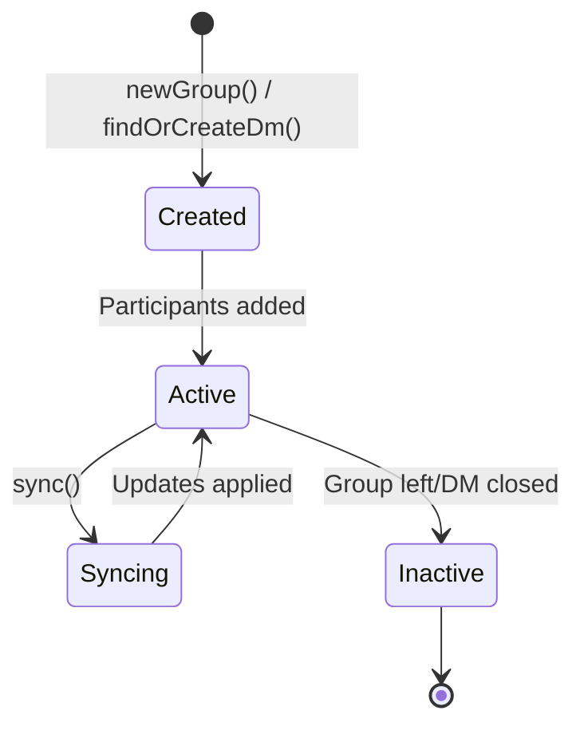

## Overview

Conversations are the core messaging abstraction in XMTP. A conversation represents a communication channel between two or more participants where messages can be exchanged.

XMTP supports two types of conversations:
- **Group Chats** - Multi-participant conversations with configurable permissions
- **Direct Messages (DMs)** - One-on-one conversations between two participants

## Conversation Types

### The Conversation Enum

XMTP provides a unified `Conversation` enum that abstracts over both groups and DMs:

```swift
public enum Conversation {
  case group(Group)
  case dm(Dm)
}
```

This allows you to work with conversations polymorphically:

```swift
let conversations = try await client.conversations.list()

for conversation in conversations {
  switch conversation {
  case .group(let group):
    print("Group: \(group.id)")
  case .dm(let dm):
    print("DM: \(dm.id)")
  }
}
```

### Group Chats

Groups support multiple participants and offer features like:
- Configurable permissions (who can add members, send messages, etc.)
- Admin and super admin roles
- Group metadata (name, image, description)
- Member management
- Disappearing messages

```swift
let group = try await client.conversations.newGroup(
  with: [address1, address2, address3],
  permissions: .allMembers,
  name: "Team Chat",
  imageUrl: "https://example.com/group.png"
)
```

### Direct Messages

DMs are lightweight one-on-one conversations:
- Always between exactly two participants
- Simpler permission model
- Optimized for bilateral communication

```swift
let dm = try await client.conversations.findOrCreateDm(with: peerAddress)
```

## Creating Conversations

### Creating a Group

```swift
// Basic group creation
let group = try await client.conversations.newGroup(
  with: [address1, address2]
)

// Group with metadata
let group = try await client.conversations.newGroup(
  with: [address1, address2],
  permissions: .adminOnly,
  name: "Project Team",
  imageUrl: "https://example.com/team.png",
  description: "Discuss project updates"
)

// Group with disappearing messages
let group = try await client.conversations.newGroup(
  with: [address1, address2],
  disappearingMessageSettings: .init(
    expiryTime: 86400 // 24 hours in seconds
  )
)
```

### Creating a Direct Message

```swift
// Find existing DM or create new one
let dm = try await client.conversations.findOrCreateDm(with: peerAddress)

// Check if DM already exists
let existingDm = try await client.conversations.findDmByInboxId(peerInboxId)
```

## Listing Conversations

### List All Conversations

```swift
// Get all conversations (groups and DMs)
let allConversations = try await client.conversations.list()

// With filtering options
let filtered = try await client.conversations.list(
  createdAfter: Date().addingTimeInterval(-7 * 86400), // Last 7 days
  createdBefore: Date(),
  limit: 50
)
```

### List by Type

```swift
// List only groups
let groups = try await client.conversations.listGroups()

// List only DMs
let dms = try await client.conversations.listDms()
```

## Finding Conversations

### By ID

```swift
// Find conversation by ID
let conversation = try await client.conversations.findConversation(by: conversationId)

// Find specific group
let group = try await client.conversations.findGroup(by: groupId)
```

### By Topic

```swift
// Find by topic string
let conversation = try await client.conversations.findConversationByTopic(topic)
```

### By Participant

```swift
// Find DM with specific user
let dm = try await client.conversations.findDmByInboxId(inboxId)
```

## Conversation Metadata

### Common Properties

All conversations share these properties:

```swift
let id: String                    // Unique conversation ID
let topic: String                 // Message topic for this conversation
let createdAt: Date              // When conversation was created
let members: [Member]            // Current members
```

### Group-Specific Metadata

```swift
// Group name
let name = try await group.name()
try await group.updateName("New Name")

// Group image
let imageUrl = try await group.imageUrl()
try await group.updateImageUrl("https://example.com/new.png")

// Group description
let description = try await group.description()
try await group.updateDescription("Updated description")

// Custom app data
let appData = try await group.appData()
try await group.updateAppData(customData)
```

## Syncing Conversations

Keep conversations up-to-date with the network:

```swift
// Sync all conversations
try await client.conversations.sync()

// Sync specific conversation
try await group.sync()

// Sync all conversations and get summary
let summary = try await client.conversations.syncAllConversations()
print("Synced \(summary.groupsSynced) groups, \(summary.dmsSynced) DMs")
```

<Note>
Syncing fetches new members, membership changes, and conversation updates from the network.
</Note>

## Streaming New Conversations

Receive notifications when new conversations are created:

```swift
for try await conversation in client.conversations.stream() {
  switch conversation {
  case .group(let group):
    print("New group created: \(group.id)")
  case .dm(let dm):
    print("New DM with: \(dm.peerInboxId)")
  }
}
```

## Conversation State

### Active vs Inactive

```swift
// Check if conversation is active
let isActive = try await group.isActive()

if !isActive {
  print("This conversation has been closed")
}
```

### Consent State

Manage conversation consent preferences:

```swift
// Get consent state
let consentState = try await group.consentState()

// Update consent
try await group.updateConsentState(.allowed)
try await group.updateConsentState(.denied)
```

### Membership State

For groups, check your membership status:

```swift
let membershipState = group.membershipState
// .allowed, .rejected, .pending, .restored, .pendingRemove
```

## Disappearing Messages

Configure messages to automatically delete after a period:

```swift
// Check if enabled
let enabled = try group.isDisappearingMessagesEnabled()

// Get current settings
if let settings = group.disappearingMessageSettings {
  print("Messages expire after \(settings.expiryTime) seconds")
}

// Update settings
try await group.updateDisappearingMessageSettings(
  .init(expiryTime: 3600) // 1 hour
)

// Clear settings (disable)
try await group.clearDisappearingMessageSettings()
```

## Conversation Lifecycle



## Best Practices

<AccordionGroup>
  <Accordion title="Sync Regularly">
    - Call `sync()` when app comes to foreground
    - Sync before displaying conversation lists
    - Use streaming for real-time updates
    - Handle sync errors gracefully
  </Accordion>

  <Accordion title="Cache Conversation Lists">
    - Cache conversation lists locally
    - Use conversation IDs as stable identifiers
    - Implement pagination for large lists
    - Refresh cache periodically
  </Accordion>

  <Accordion title="Handle Conversation Types">
    - Use the `Conversation` enum for unified handling
    - Pattern match on conversation type when needed
    - Consider type-specific UI treatments
    - Support both groups and DMs in your UI
  </Accordion>

  <Accordion title="Manage Consent">
    - Check consent state before showing conversations
    - Provide UI for users to manage consent
    - Respect denied consent states
    - Implement spam filtering based on consent
  </Accordion>
</AccordionGroup>

## Next Steps

<CardGroup cols={2}>
  <Card title="Managing Conversations" icon="gear" href="/guides/managing-conversations">
    Learn how to manage conversations in your app
  </Card>
  <Card title="Group Chat Guide" icon="users" href="/guides/group-chat">
    In-depth guide to group chat features
  </Card>
  <Card title="Direct Messages" icon="message" href="/guides/direct-messages">
    Learn about direct messaging
  </Card>
  <Card title="Messages" icon="paper-plane" href="/concepts/messages">
    Understand message handling
  </Card>
</CardGroup>

## Related APIs

- [Conversations API](/api/conversations) - Complete API reference
- [Group API](/api/group) - Group-specific methods
- [DM API](/api/dm) - Direct message methods
- [Conversation Enum](/api/conversation) - Unified conversation interface
